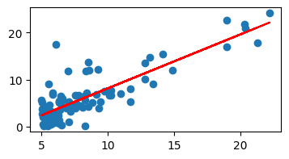

# Grupo
- Gabriel Costa Warken, cartão 179787, turma A (manhã)
- Joana Oliveira DAvila, cartão 274739, turma A (manhã)
- Diogo Brum Rivoire, cartão 344735, turma B (tarde)

  
# Parte 1
### Regressão Linear
Valores iniciais de b, w, valores de alpha e num_iterations que resultem na melhor execução da sua regressão linear.

###  Erro quadrático médio obtido na sua implementação da regressão linear.

Valores iniciais: 
    b = 1
    w = 0,75
    alpha = 0,01 
    num_iterations = 1500
    

Erro quadrático final: 
    8.527783901973569

Curva encontrada: 
    1.1585957365061903*x + -3.429571179361111

Inicialmente, alterar o valor de alpha de 1 para 0,01 melhorou dramaticamente o erro quadrático. Alterando o valor de alpha para 0,001 o erro quadrático voltou a piorar.
Testando iterativamente os valores de b e w, se alcançou uma curva suave com b = 1, w = 0,75 com o número de iterações fixado em 1500. Valores de iterações maiores resultaram em curvas cada vez piores.

# Parte 2
### Análise dos datasets 
(quantas classes, quantas amostras, qual o tamanho das imagens (altura x largura x canais de cor))

| Dataset        | Classes | Quantas Amostras | Tamanho das Imagens     |
|----------------|---------|------------------|--------------------------|
| Fashion-MNIST  | 10      | 60000            | 28 x 28 x 1 (escala de cinza) |
| MNIST          | 10      | 60000            | 28 x 28 x 1 (escala de cinza) |
| CIFAR-10       | 10      | 60000            | 32 x 32 x 3 (RGB)             |
| CIFAR-100      | 100     | 60000          | 32 x 32 x 3 (RGB)             |

# Conclusões
### Suas conclusões considerando as questões do Exercício 1.

### Suas conclusões considerando as questões do Exercício 2.
A ordem de complexidade dos datasets, do menos para o mais complexo, é: MNIST, Fashion MNIST, CIFAR-10 e CIFAR-100. O MNIST é o mais simples devido ao número limitado de classes (10) e às imagens em escala de cinza de baixa resolução. O Fashion MNIST é levemente mais complexo por ter imagens de roupas com mais variação. O CIFAR-10 apresenta imagens coloridas e objetos do mundo real, tornando a tarefa de classificação mais difícil, mas com menos classes (10). O CIFAR-100 é o mais desafiador, com 100 classes e uma quantidade menor de imagens por classe, o que aumenta a complexidade devido à grande variação de dados e ao risco de overfitting. O número de classes, a variabilidade das imagens, a resolução e a quantidade de dados por classe são fatores cruciais que influenciam a dificuldade de cada dataset.

MNIST e Fashion MNIST possuem imagens pequenas (28x28) e apenas um canal (preto e branco), além de terem o mesmo número de classes (10) e uma boa quantidade de amostras por classe (6000). Como esperado, a acurácia no MNIST foi extremamente alta, e no Fashion MNIST também foi bastante satisfatória, mesmo sendo um conjunto mais desafiador. A simplicidade das imagens e a baixa dimensionalidade favorecem redes menores. CIFAR-10 e CIFAR-100 apresentam imagens coloridas (32x32x3) e, embora tenham o mesmo número total de amostras (60000), a distribuição por classe no CIFAR-100 é muito menor (600 imagens por classe contra 6000 no CIFAR-10), o que torna a generalização mais difícil.
# Extra 
Documentação do(s) extra(s) implementado(s), se aplicável.
